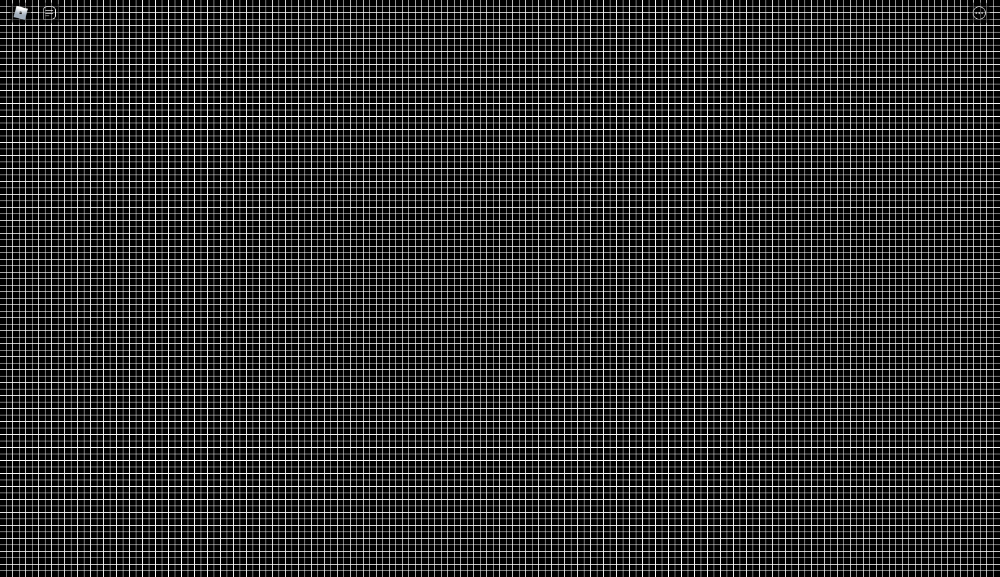

# Sphere-Tracer

A small project where you fly around infinite spheres. Rendered using ray-marching. (You can also change the scene)

### Runners

**Realtime**

Go into the `Config.lua` on the _client_ and make sure that `Runner` is set to `Config.RUNNERS.RealTime`.
This runner will just run an infinite while loop.

**Parallel**

Go into the `Config.lua` on the _client_ and make sure that `Runner` is set to `Config.RUNNERS.Parallel`.
This runner will use multiple scripts in multiple actors to run in parallel. (**NOTE:** Only works in studio!)

**Image**

Go into the `Config.lua` on the _client_ and make sure that `Runner` is set to `Config.RUNNERS.Image`.
Now run `npm run dev` in a terminal.
Play the game in studio, and a beautiful HD image will be saved to `./image.png`.

# Image Gallery

